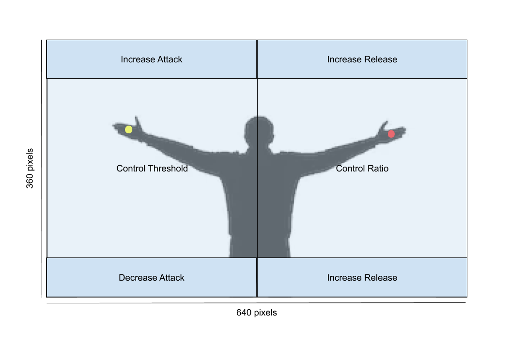

# Gestik- og stemmestyret DAW
Udforskende brug af gestik- og stemmestyring i interaktionen mellem lydtekniker og DAW (Digital Audio Workstation). Prototypen tillader en kropslig interaktion med lydmaterialet, der fordrer bedre lyttefokus og færre visuelle forstyrrelser. Prototypen er programmeret i Processing og gør brug af colortracking via kamera-input og stemmestyring via Google Chrome. Disse input oversættes til MIDI-signaler som videresendes til en DAW (Logic Pro X). Via gestikulation og stemmekommandoer kan man kontrollere lydstyrke, panorering, samt værktøjerne kompressor, equalizer og rumklang. [Se en demonstration af prototypen i brug her.](https://www.thomaseg.dk/)

## Lydstyrke og panorering

## Kompressor

## Equalizer

## Rumklang

## MIDI-routing

